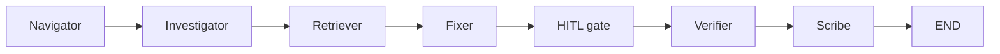
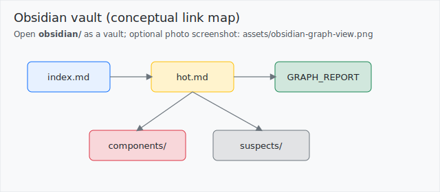

# graphdebug

**Graph-guided, multi-agent debugging** for HW4: build a **Graphify** graph and **Obsidian** vault from an unfamiliar repo, run a **LangGraph** supervisor + workers under **budget + gatekeeper**, compare **naive vs graph** token use, and document evidence end-to-end.

**Planning (canonical, repo root):** [`prd.md`](prd.md) · [`plan.md`](plan.md) · [`todo.md`](todo.md)  
**Mechanism PRDs (expanded):** [`docs/PRD_multiagent.md`](docs/PRD_multiagent.md) · [`docs/PRD_token_ledger.md`](docs/PRD_token_ledger.md)  
**Submission verdict:** [`reports/READINESS_VERDICT.md`](reports/READINESS_VERDICT.md)

---

## Target repository and bug

**Subject:** BugsInPy **PySnooper / bug `1`** ([upstream](https://github.com/cool-RR/PySnooper)).

| Item | Value |
|------|--------|
| Buggy commit | `e21a31162f4c54be693d8ca8260e42393b39abd3` |
| Failing test | `tests/test_chinese.py::test_chinese` |
| Symptom | `UnicodeEncodeError` (`charmap` / **cp1252**) when snoop output contains non-ASCII text on typical Windows defaults |
| Evidence (red) | [`results/baseline_red.txt`](results/baseline_red.txt) |
| Subject tree | `data/pysnooper-bugsinpy-1/` — see [`data/pysnooper-bugsinpy-1/SETUP.md`](data/pysnooper-bugsinpy-1/SETUP.md) |

### Why this repo / bug (assignment §2)

- **Pure Python**, **small dependency surface** — viable on Windows class timelines.
- **OOP-rich enough** for graph, vault, and centrality work (tracer, `FileWriter`, formatting).
- **Deterministic red baseline** when UTF-8 mode is off; see `SETUP.md` and `reports/bug_analysis.md`.

---

## Research questions (RQ1–RQ8) — explicit answers

| ID | Short answer | Where to read more |
|----|----------------|-------------------|
| **RQ1** | First read: “small tracing decorator.” Graph + Louvain blocks show **runtime composition** (tracer, variables, utils, tests) as **coupled subsystems**, not a flat script. | [`reports/architecture.md`](reports/architecture.md), [`assets/architecture.png`](assets/architecture.png) |
| **RQ2** | **Betweenness + degree** on imports/calls/contains ranks hubs (e.g. test helpers, `variables.py`, `tracer.py`); used for **suspect ranking**. | [`reports/god_nodes.md`](reports/god_nodes.md), [`reports/extensions.md`](reports/extensions.md) (T9.1) |
| **RQ3** | **God nodes** = high betweenness / threshold union on the structural subgraph — evidence in tables, not vibes. | [`reports/god_nodes.md`](reports/god_nodes.md), [`obsidian/God nodes.md`](obsidian/God%20nodes.md) |
| **RQ4** | Thin upstream docs → derive **block + OOP** from `graph.json` **relations**; spot-check `inherits`/`contains` vs source. | [`reports/architecture.md`](reports/architecture.md), [`assets/oop.png`](assets/oop.png) |
| **RQ5** | **Symptom:** encoding error on log write. **Root cause (engineering):** log I/O used **default encoding** instead of UTF-8 for trace lines with non-ASCII payload (see failing path in baseline log and [`reports/bug_analysis.md`](reports/bug_analysis.md)). **Fix:** open/write log stream with explicit **UTF-8** (aligns with BugsInPy `bug_patch.txt` — validate after your own investigation). | [`reports/bug_analysis.md`](reports/bug_analysis.md), [`obsidian/hot.md`](obsidian/hot.md) |
| **RQ6** | Graph + vault let the agent **orient and rank suspects** before **budgeted** file reads; naive mode reads broadly with the **same** model and caps profile (`budgets.naive`). | [`docs/PRD_multiagent.md`](docs/PRD_multiagent.md), [`reports/token_comparison.md`](reports/token_comparison.md) |
| **RQ7** | **Measured** savings from **ledger aggregates** (tokens, file reads) per run `manifest.json` / `ledger.jsonl` — run Phase 8 harness; no guessed numbers. | [`reports/token_comparison.md`](reports/token_comparison.md), [`docs/PRD_token_ledger.md`](docs/PRD_token_ledger.md) |
| **RQ8** | Extensions: suspect rank, **hot.md from git diff**, impact closure, doc-vs-graph heuristics, ego report — each with API + tests. | [`reports/extensions.md`](reports/extensions.md) |

---

## Architecture overview

- **`src/graphdebug/sdk/`** — public facade (`api.py` re-exports). **G.3:** CLI, tests, and notebooks should call the SDK, not `services/*` internals.
- **`src/graphdebug/services/`** — graph load/query, vault, agents, ledger, experiment, phase-7 helpers.
- **`src/graphdebug/shared/`** — config load, **gatekeeper** (rate limit, retry, redaction hooks).
- **`config/default.yaml` + `.env`** — tunables and secrets (**G.5**); never hardcode model names in code paths.

### Multi-agent workflow (supervisor + workers)



- **Graph mode:** Navigator uses vault summaries; Investigator uses `graph.json` (+ ranking); Retriever is the **only** worker that reads source, under caps.
- **Naive mode:** Same graph shape; different context (see PRD). LLM calls still go through the **gatekeeper** in implemented paths.

---

## Reverse engineering process (Phase 4)

1. Ingest committed **`artifacts/graphify/graph.json`** via the loader (`graphdebug graphify-load`).
2. Build a **NetworkX** subgraph on structural relations; **Louvain** communities → block diagram (**not** the folder tree).
3. Slice **inherits / contains / uses / method** for the OOP figure; validate samples against source.
4. Export PNG + markdown reports: `uv run graphdebug phase4-export`.

**Outputs:** [`assets/architecture.png`](assets/architecture.png), [`assets/oop.png`](assets/oop.png), [`reports/architecture.md`](reports/architecture.md), [`reports/god_nodes.md`](reports/god_nodes.md).

---

## Graphify and Obsidian

**Artifacts (immutable):** `artifacts/graphify/` — `graph.json`, `GRAPH_REPORT.md`, `graph.html`, and `RUN.md` (how Graphify was run).

**Regenerate vault pages from the graph:**

```bash
uv sync --all-groups
uv run graphdebug vault-build
uv run graphdebug vault-build --snapshot   # optional: results/knowledge_snapshots/before/
```

Open the [`obsidian/`](obsidian/) folder as an Obsidian vault. **Optional real UI screenshot** for graders: save as [`assets/obsidian-graph-view.png`](assets/obsidian-graph-view.png) per [`assets/README.md`](assets/README.md). **Conceptual map (always in repo):**



---

## Token efficiency (Phase 8)

Same bug task, **naive then graph**, identical model/seed/temperature from config; arms differ only in **context strategy**.

```bash
uv run graphdebug experiment \
  --target-root data/pysnooper-bugsinpy-1 \
  --test tests/test_chinese.py::test_chinese \
  --symptom "UnicodeEncodeError on non-ASCII snoop output" \
  --assume-hitl-ack
```

This refreshes **[`reports/token_comparison.md`](reports/token_comparison.md)** and **[`assets/token_chart.png`](assets/token_chart.png)** from ledgers. Reproduce tables in [`notebooks/experiment.ipynb`](notebooks/experiment.ipynb).


---

## Extensions (Phase 9)

Summary table of original mechanisms + examples: **[`reports/extensions.md`](reports/extensions.md)**.

---

## Before / after knowledge

- **Before snapshot:** `results/knowledge_snapshots/before/` (from `vault-build --snapshot` or `vault-snapshot`).
- **After snapshot / diff:** use `graphdebug phase7` subcommands when you reach Phase 7 (`todo.md` T7.7); scaffold output is described in `todo.md`.

---

## Installation and configuration

**Prerequisites:** [uv](https://docs.astral.sh/uv/) and Python **3.12+** (see `pyproject.toml`).

```bash
uv sync --all-groups
cp .env-example .env
# Edit .env: set OPENAI_API_KEY (or GRAPHDEBUG_OPENAI_API_KEY)
```

**Configure behavior** in [`config/default.yaml`](config/default.yaml) (budgets, model, paths, gatekeeper). **Secrets only in `.env`** — never commit `.env`.

---

## Clear run instructions (end-to-end)

```bash
uv sync --all-groups
cp .env-example .env   # add API key
uv run ruff check .
uv run pytest --cov=src

uv run graphdebug --help
uv run graphdebug graphify-load --in artifacts/graphify/graph.json
uv run graphdebug vault-build
uv run graphdebug phase4-export

# Investigation (costs tokens — mock tests cover CI)
uv run graphdebug investigate --mode graph \
  --target-root data/pysnooper-bugsinpy-1 \
  --test tests/test_chinese.py::test_chinese \
  --symptom "UnicodeEncodeError on non-ASCII snoop output" \
  --assume-hitl-ack

# Token experiment (both arms)
uv run graphdebug experiment \
  --target-root data/pysnooper-bugsinpy-1 \
  --test tests/test_chinese.py::test_chinese \
  --symptom "UnicodeEncodeError on non-ASCII snoop output" \
  --assume-hitl-ack
```

**Subject baseline (red/green on real tree):** [`data/pysnooper-bugsinpy-1/SETUP.md`](data/pysnooper-bugsinpy-1/SETUP.md) and [`scripts/run_subject_baseline.ps1`](scripts/run_subject_baseline.ps1) if present.

---

## Troubleshooting

| Issue | What to do |
|-------|------------|
| `pytest` passes on Windows “before” the bug | **PYTHONUTF8** or system UTF-8 may be on — disable for an honest cp1252 red baseline (`SETUP.md`). |
| `OPENAI_API_KEY` errors | Fill `.env` from `.env-example`; never paste keys into issues or commits. |
| Coverage / lint failures | `uv run pytest --cov=src` must be ≥85% on `src/`; `uv run ruff check .` must be 0. |
| Line-limit test only | `uv run pytest tests/unit/test_file_line_limits.py --no-cov -q` (default pytest enables coverage). |
| Missing `data/pysnooper-bugsinpy-1` | Clone/checkout per Phase 1 instructions in `todo.md` / `SETUP.md`. |

---

## Line budget (G.6)

Every `*.py` under `src/graphdebug/` and `tests/` must have **≤ 150 non-blank lines**. Enforced by [`tests/unit/test_file_line_limits.py`](tests/unit/test_file_line_limits.py).

---

## Credits and third-party licenses

- **This repository (`graphdebug` sample code):** [MIT](LICENSE).
- **PySnooper (subject under `data/`):** MIT — see upstream [PySnooper](https://github.com/cool-RR/PySnooper); BugsInPy metadata in [BugsInPy](https://github.com/soarsmu/BugsInPy). Subject code retains **its** license; this project does not relicense upstream trees.
- **Graphify** (external tool used to produce `artifacts/graphify/`) — cite the tool and version recorded in `artifacts/graphify/RUN.md`.
- **Libraries:** LangGraph, LangChain, NetworkX, Matplotlib, PyYAML, python-dotenv — see `pyproject.toml` / `uv.lock` for versions and SPDX metadata from publishers.

---

## Documentation sync (`docs/`)

Root **`prd.md`**, **`plan.md`**, **`todo.md`** are canonical. [`docs/README.md`](docs/README.md) explains mirroring; [`docs/PRD.md`](docs/PRD.md) and [`docs/PLAN.md`](docs/PLAN.md) / [`docs/TODO.md`](docs/TODO.md) are **pointers** to those files so the `docs/` layout stays consistent (**T10.4**).
