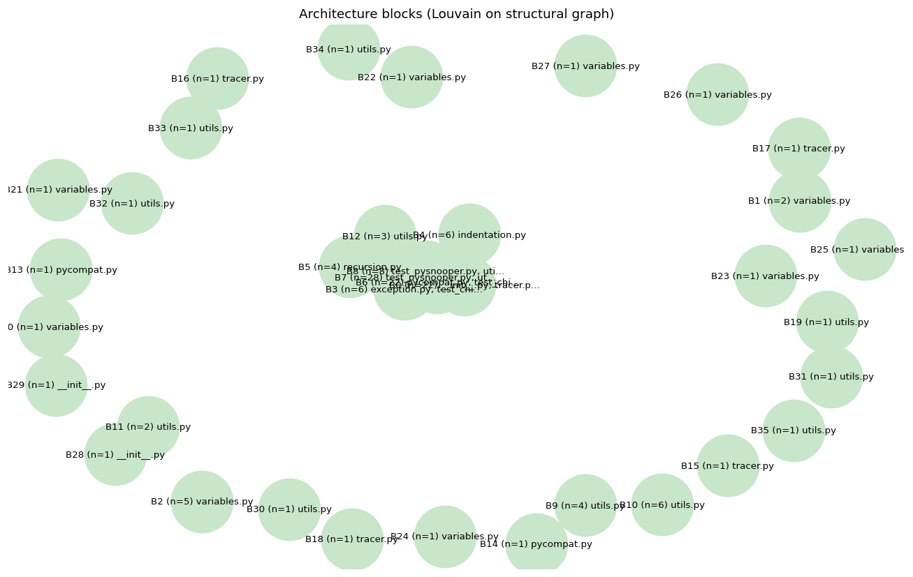
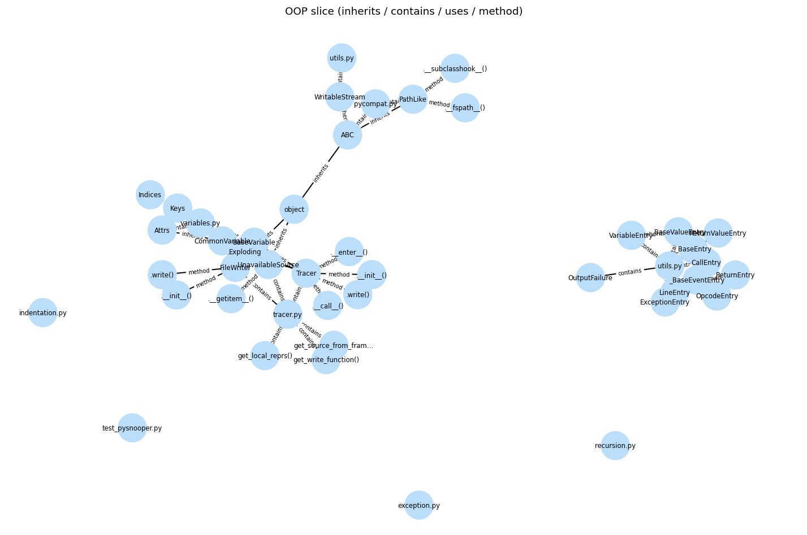
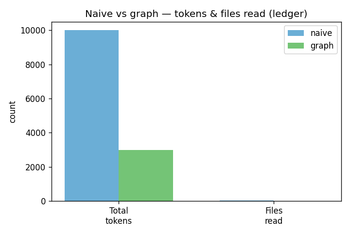

# graphdebug

Graph-guided, multi-agent debugging coursework project (**HW4**).

## Target repository & bug (Phase 1)

**Primary subject**: [BugsInPy](https://github.com/soarsmu/BugsInPy) benchmark — **`PySnooper` / bug `1`**.

| Item | Value |
|------|--------|
| Upstream | [cool-RR/PySnooper](https://github.com/cool-RR/PySnooper) |
| Buggy commit | `e21a31162f4c54be693d8ca8260e42393b39abd3` |
| Failing test | `tests/test_chinese.py::test_chinese` |

### Why this repo / bug

- **Pure Python**, **tiny dependency surface** (BugsInPy ships an empty `requirements.txt` for this bug) — fast to stand up on Windows class timelines (`prd.md` §11, `todo.md` **T1.1**).
- **OOP-rich enough** for later graph / vault work: decorator-wrapped tracing, `FileWriter`, variable formatting, cross-module interactions.
- **Reproducible red baseline** on Windows with default **cp1252** encoding: `UnicodeEncodeError` when snoop logs non-ASCII text; evidence in `results/baseline_red.txt`.
- **Isolation**: subject dependencies live only under `data/pysnooper-subject-env/` — **not** in the `graphdebug` root `pyproject.toml` / `uv.lock` (`todo.md` **T1.4**).

Reproduce: `data/pysnooper-bugsinpy-1/SETUP.md` (or `scripts/run_subject_baseline.ps1`).

## Quickstart (Phase 0 scaffold)

```bash
uv sync --all-groups
cp .env-example .env   # then set OPENAI_API_KEY
uv run ruff check .
uv run pytest
uv run graphdebug --help
```

Obsidian vault (Phase 3): from the repo root, regenerate graph-backed pages with:

```bash
uv run graphdebug vault-build
uv run graphdebug vault-build --snapshot   # optional: results/knowledge_snapshots/before/
```

Phase 4 (centrality, god-node report, diagrams): from the repo root:

```bash
uv run graphdebug phase4-export
```

This writes `reports/god_nodes.md`, `reports/architecture.md`, `obsidian/God nodes.md`, and
`assets/architecture.png` / `assets/oop.png` (plus `.mmd` sources).

## Architecture diagrams (Phase 4)

Subsystem blocks are derived from **graph topology** (Louvain communities on structural edges),
not from the directory tree. The OOP diagram uses the **inherits / contains / uses / method**
slice of `graph.json`. See `reports/architecture.md` for RQ1 / RQ4 narrative.





## Token experiment (Phase 8)

Run **naive then graph** with one command (same model, temperature, and `llm.seed` from `config/default.yaml`; arms differ only in context strategy). This writes `reports/token_comparison.md` and `assets/token_chart.png` from **ledger aggregates** in each run’s `manifest.json`.

```bash
uv run graphdebug experiment \
  --target-root data/pysnooper-bugsinpy-1 \
  --test tests/test_chinese.py::test_chinese \
  --symptom "UnicodeEncodeError on non-ASCII snoop output" \
  --assume-hitl-ack
```

Reproduce the tables in `notebooks/experiment.ipynb`. The committed `assets/token_chart.png` is an **illustrative** sample (same shape as the harness output); real runs overwrite it.



Authoritative checklists and requirements: see `prd.md`, `plan.md`, and `todo.md` at the repo root.
