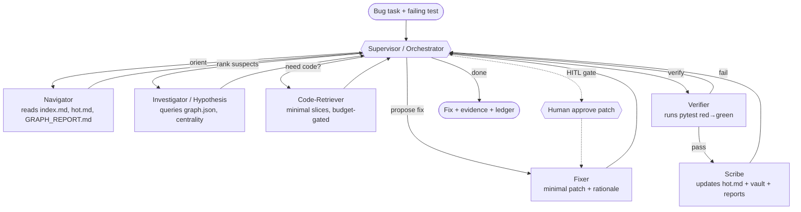
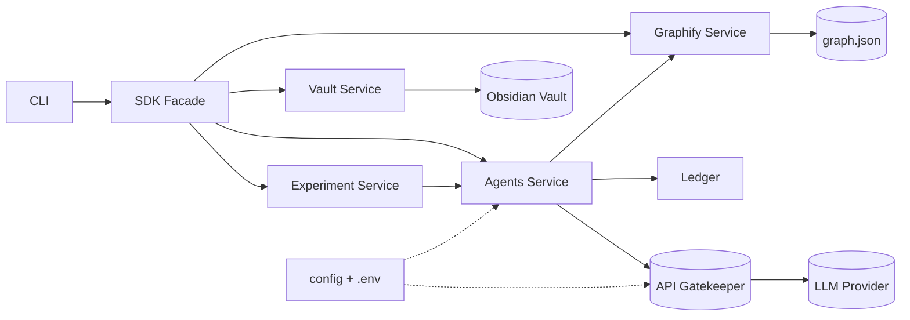
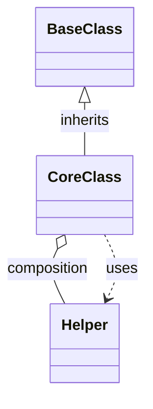

# PLAN — Graph-Guided AI Debugging Agent (`graphdebug`)

> **HW4 — AI Agents Orchestration.** Architecture & phased execution plan.
> Companion: [`prd.md`](./prd.md). PRD = *what/why*; this PLAN = *how*.
> Requirement IDs (e.g. `FR-A1`, `RQ5`) reference `prd.md`.

---

## 0. Document Control

| Field | Value |
|---|---|
| Project | `graphdebug` |
| Package | `src/graphdebug/` |
| Runtime | Python (managed by **`uv` only**) |
| Agent framework | **LangGraph** (supervisor / worker pattern) |
| Graph engine | **Graphify** (`graph.json`, `GRAPH_REPORT.md`, `graph.html`, `--obsidian`) |
| Status | DRAFT → REVIEW → APPROVED |

---

## 1. Architecture Overview (C4-style)

### 1.1 Context (L1)
A pair of engineers + a graph-guided multi-agent system investigate an **unfamiliar buggy
repo**. External systems: **LLM provider** (via Gatekeeper), **Graphify**, **Obsidian**,
the **target repo** (e.g. BugsInPy bug), and the **test runner** (`pytest`).

### 1.2 Containers (L2)
1. **CLI** (`graphdebug ...`) — thin entrypoint, calls SDK only.
2. **SDK layer** — public API; all business logic exposed here (`FR-S1`).
3. **Services** — Graphify loader, vault builder, agent workflow, token-ledger, experiment.
4. **Shared** — `config.py`, `gatekeeper.py`, `version.py`, constants.
5. **Artifacts/Vault/Reports** — Graphify outputs, Obsidian vault, generated reports.

### 1.3 Components (L3) — see §5 and the diagrams in §11.

---

## 2. High-Level Multi-Agent Structure (LangGraph)

A **Supervisor** orchestrates specialized workers over a shared **AgentState**. Workers
consume the **graph + vault first** and request raw code **only when justified** (`FR-A2`).
The **Context/Token Budget** gates every step (`FR-A5`).



**Routing**: supervisor returns `Command(goto=<worker>)` based on state flags
(`oriented`, `suspects_ranked`, `code_fetched`, `patch_ready`, `verified`). Hard caps:
max iterations, max tokens, max files (from `config/`).

**Why multi-agent (not one mega-prompt)**: separation of concerns keeps each prompt small
(mitigates *Lost in the Middle*), makes token accounting per role explicit, and lets us
disable raw-code reading for all roles except the budget-gated Retriever.

---

## 3. Project Structure

```text
HW4/
├── README.md
├── prd.md                      # product requirements (this PRD)
├── plan.md                     # this plan
├── pyproject.toml              # uv-managed
├── uv.lock
├── .env-example                # never commit .env
├── .gitignore
├── src/
│   └── graphdebug/
│       ├── __init__.py
│       ├── constants.py
│       ├── sdk/                # public API (FR-S1): facade over services
│       │   ├── __init__.py
│       │   └── api.py
│       ├── services/
│       │   ├── graphify/       # load/parse graph.json -> typed model (FR-G4)
│       │   ├── vault/          # build/update index.md, hot.md, pages (FR-O*)
│       │   ├── agents/         # LangGraph supervisor + workers (FR-A*)
│       │   ├── analysis/       # centrality, god-nodes, impact (FR-R3,E1,E4)
│       │   ├── ledger/         # token/tool ledger (FR-T3)
│       │   └── experiment/     # naive vs graph-guided harness (FR-T*)
│       └── shared/
│           ├── config.py       # all configurable values (no hardcoding)
│           ├── gatekeeper.py   # central API gatekeeper (FR-S2)
│           └── version.py
├── tests/
│   ├── unit/
│   └── integration/
├── docs/
│   ├── PRD.md -> see prd.md    # or symlink/copy; per-mechanism PRDs below
│   ├── PLAN.md -> see plan.md
│   ├── TODO.md
│   ├── PRD_multiagent.md
│   └── PRD_token_ledger.md
├── config/                     # yaml/toml: rate limits, budgets, model names
├── data/                       # target repo / bug working copy (gitignored if large)
├── results/                    # run logs, ledgers, raw experiment outputs
├── assets/                     # diagrams, screenshots, charts
├── notebooks/                  # token experiment notebook
├── obsidian/                   # Obsidian vault (index.md, hot.md, pages)
├── reports/                    # bug_analysis.md, token_comparison.md, etc.
└── artifacts/
    └── graphify/               # graph.json, GRAPH_REPORT.md, graph.html
```

---

## 4. ADRs (Architecture Decision Records)

| ADR | Decision | Rationale | Alternatives |
|---|---|---|---|
| ADR-1 | **LangGraph** over CrewAI | Finer control of call count/stages on free tier (assignment §6.1) | CrewAI |
| ADR-2 | **Graphify** as graph engine | Required; emits `graph.json` + Obsidian vault | custom AST graph |
| ADR-3 | **Supervisor/worker** topology | Small per-role prompts; explicit budget per role | single ReAct agent |
| ADR-4 | **SDK facade** for all logic | System-prompt rule; testability; CLI/agents stay thin | logic in CLI |
| ADR-5 | **Central Gatekeeper** for LLM | Rate-limit/retry/queue/cost control (`FR-S2`) | per-call SDK usage |
| ADR-6 | **Primary = one BugsInPy bug** (light-dep), fallback buggy-python | Realistic RE + OOP/God-node material; bounded risk | snippet-only |

---

## 5. Component Design

### 5.1 SDK Layer (`sdk/api.py`) — `FR-S1`
Public facade exposing all use-cases; CLI and agents call only this:
- `load_graph(path) -> CodeGraph`
- `build_vault(graph, out_dir, mode) -> VaultIndex`
- `update_hot(diff, graph) -> HotPage` (extension `FR-E2`)
- `investigate(bug_task, mode) -> InvestigationResult`
- `run_experiment(bug_task) -> ExperimentReport`
- `rank_suspects(graph, failing_tests) -> list[SuspectNode]` (`FR-E1`)
- `impact_of(graph, node_id) -> ImpactReport` (`FR-E4`)

### 5.2 Graphify Service (`services/graphify/`) — `FR-G4`
- `loader.py`: parse `graph.json` → typed `CodeGraph` (nodes, edges, clusters, metadata).
- `query.py`: hop-by-hop traversal, neighbors, path between nodes, edge detail (mirrors
  Graphify `query/path/explain`) **without re-reading source**.
- `metrics.py`: degree/betweenness/closeness centrality (NetworkX) for RQ2/RQ3.

### 5.3 Vault Service (`services/vault/`) — `FR-O*`
- `builder.py`: writes `index.md`, component/test/finding/suspect pages with `[[wikilinks]]`.
- `hot.py`: creates/updates `hot.md` (suspects, checks done, status, next action).
- `snapshot.py`: before/after knowledge diff (`FR-O4`).

### 5.4 Agents Service (`services/agents/`) — `FR-A*` (detail in `docs/PRD_multiagent.md`)
- `state.py`: `AgentState` TypedDict (§6).
- `supervisor.py`: routing node returning `Command(goto=...)`.
- `workers/`: `navigator.py`, `investigator.py`, `retriever.py`, `fixer.py`,
  `verifier.py`, `scribe.py` — each a node with a small, role-scoped prompt.
- `budget.py`: context/token budget guard (`FR-A5`); raises/halts on cap breach.
- `graph_app.py`: builds & compiles the LangGraph; optional checkpointer for HITL.

### 5.5 Ledger Service (`services/ledger/`) — `FR-T3` (detail in `docs/PRD_token_ledger.md`)
Records per step: role, prompt/completion/total tokens, tool calls, files read, latency.
Persists JSONL to `results/<run_id>/ledger.jsonl`; aggregates to summary.

### 5.6 Experiment Service (`services/experiment/`) — `FR-T*`
Runs the **same bug task** in two modes (naive / graph-guided), same model+seed, collects
two ledgers, emits `reports/token_comparison.md` + chart in `assets/`.

### 5.7 Shared
- `config.py` (`FR-S2`, NFR): loads `config/*.yaml` + `.env`; exposes model names, rate
  limits, budgets, paths, feature flags. **No hardcoded configurable values.**
- `gatekeeper.py` (`FR-S2`): single chokepoint for LLM calls — token-bucket rate limiting,
  bounded queue (backpressure), retries w/ exponential backoff, structured logging, and
  ledger hooks. All worker LLM calls go through it.
- `version.py`, `constants.py`: version string and non-config constants.

---

## 6. Data Schemas

### 6.1 `AgentState` (shared, typed)
```python
class AgentState(TypedDict):
    bug_task: BugTask              # repo, failing tests, symptom
    mode: Literal["naive","graph"]
    oriented: bool                 # Navigator done
    suspects: list[SuspectNode]    # ranked (id, score, why, centrality, test_proximity)
    suspects_ranked: bool
    fetched_code: dict[str,str]    # node_id -> minimal slice (Retriever only)
    code_fetched: bool
    hypothesis: str                # current root-cause hypothesis
    patch: Optional[Patch]         # unified diff + rationale
    patch_ready: bool
    verified: bool                 # tests green, no regressions
    iterations: int
    budget: BudgetState            # tokens_used, tool_calls, files_read, caps
    messages: list[AnyMessage]     # short, role-scoped
    log: list[StepRecord]          # for ledger
```

### 6.2 `CodeGraph` (from `graph.json`)
`nodes[]` = {id, kind(file/class/func), name, path, cluster, centrality?}; `edges[]` =
{src, dst, relation(calls/imports/inherits/uses/contains), confidence, source_loc}.

### 6.3 `BudgetState`
{`max_tokens`, `max_tool_calls`, `max_files`, `max_iterations`, plus running counters};
checked by `budget.py` before each LLM/tool call.

### 6.4 Report schemas
- `bug_analysis.md`: Problem → Reproduction → Investigation trail → Root cause → Fix → Tests.
- `token_comparison.md`: table (tokens, files, iterations, time, outcome) + chart + verdict.

---

## 7. Phased Execution Plan

> Each phase lists **Inputs → Tasks → Outputs → Definition of Done (DoD)**. Phases map to
> `prd.md` milestones M0–M6 and requirement IDs.

### Phase 0 — Environment & Scaffolding  *(M0)*
- **In**: empty workspace, system-prompt standards.
- **Tasks**: `uv init`; create structure (§3); add deps (`langgraph`, `langchain-<provider>`,
  `networkx`, `pyyaml`, `python-dotenv`, `pytest`, `pytest-cov`, `ruff`); write
  `config/*.yaml`, `.env-example`, `.gitignore`; stub `version.py`/`constants.py`.
- **Out**: runnable skeleton, `uv.lock`, passing `ruff` on empty modules.
- **DoD**: `uv run ruff check .` clean; `uv run pytest` collects 0 tests OK.

### Phase 1 — Repo & Bug Selection + Red Baseline  *(M0)*  `RQ5`, `FR-B1`
- **Tasks**: pick target per `prd.md §11`; isolate env (uv/conda/Docker for BugsInPy);
  check out **buggy** version; run target test → **confirm it fails**; record symptom.
- **Out**: `data/<target>/` working copy; `reports/bug_analysis.md` (problem + red baseline).
- **DoD**: failing test reproduced deterministically; selection justified in README draft.

### Phase 2 — Graphify Representation  *(M1)*  `FR-G1..G3`
- **Tasks**: run Graphify on target (with `--obsidian`); persist outputs to
  `artifacts/graphify/`; copy/seed vault into `obsidian/`.
- **Out**: `graph.json`, `GRAPH_REPORT.md`, `graph.html`, base vault.
- **DoD**: `graph.json` parses via `graphify.loader`; report opens; vault non-empty.

### Phase 3 — Obsidian Knowledge Vault  *(M1)*  `FR-O1..O3`, `RQ1`
- **Tasks**: author `index.md` (system map + nav paths); seed `hot.md` (suspects/checks/
  status); add component/test/finding/suspect pages with wikilinks.
- **Out**: navigable vault.
- **DoD**: `index.md` links resolve; `hot.md` reflects current investigation state.

### Phase 4 — Reverse Engineering & Diagrams  *(M2)*  `FR-R*`, `RQ1..RQ4`
- **Tasks**: compute centrality (`metrics.py`); identify **God Nodes**; derive
  **architecture block diagram** and **OOP diagram** from graph relations (not folders).
- **Out**: `assets/architecture.*`, `assets/oop.*`, `reports/architecture.md`,
  `reports/god_nodes.md`.
- **DoD**: both diagrams committed; God-node list backed by centrality numbers.

### Phase 5 — Multi-Agent Workflow Build  *(M3)*  `FR-A*`, `FR-S*`
- **Tasks**: implement `AgentState`, supervisor routing, six workers, `budget.py`,
  `gatekeeper.py`, SDK facade; wire CLI; HITL gate before patch apply.
- **Out**: compiled LangGraph; `uv run graphdebug investigate --mode graph`.
- **DoD**: dry-run on a trivial fixture routes through all nodes within budget; unit tests pass.

### Phase 6 — Run Investigation  *(M3)*  `FR-A2`, `RQ5`, `RQ6`
- **Tasks**: run graph-guided investigation; Navigator→Investigator rank suspects;
  Retriever fetches minimal code; Fixer proposes patch; ledger records everything.
- **Out**: `InvestigationResult`, populated `hot.md`, `results/<run_id>/ledger.jsonl`.
- **DoD**: a concrete root-cause hypothesis + candidate patch produced under caps.

### Phase 7 — Bug Fix & Verification  *(M4)*  `FR-B2..B5`
- **Tasks**: apply minimal fix (after HITL approval); run target test → **green**; run
  available suite → no new failures; write full `bug_analysis.md`.
- **Out**: code diff; green tests; before/after knowledge snapshot (`snapshot.py`).
- **DoD**: red→green proven; `reports/bug_analysis.md` complete; vault updated.

### Phase 8 — Token-Savings Experiment  *(M5)*  `FR-T*`, `RQ7`
- **Tasks**: run **naive** mode (raw-file reading, no graph/vault) and **graph-guided**
  mode on the same task/model/seed; aggregate ledgers; build chart + report; notebook.
- **Out**: `reports/token_comparison.md`, `assets/token_chart.*`, `notebooks/experiment.ipynb`.
- **DoD**: KPIs in `prd.md §6` met or deviation explained.

### Phase 9 — Extensions  *(M5)*  `FR-E*`, `RQ8`
- **Tasks**: implement ≥1 extension per area: suspect ranking by centrality+test-proximity
  (`FR-E1`), dynamic `hot.md` from `git diff`+`graph.json` (`FR-E2`), impact report
  (`FR-E4`), optional doc-vs-behavior + before/after graph delta.
- **Out**: `reports/extensions.md`, supporting code + tests.
- **DoD**: each extension runnable + documented with an example.

### Phase 10 — Documentation & Final Audit  *(M6)*  `RQ1..RQ8`
- **Tasks**: write rich `README.md` (repo choice + justification, RQs, architecture, agent
  workflow, Graphify/Obsidian usage, RE process, bug+root cause+fix, before/after, token
  efficiency, extensions, run instructions, visuals); ensure ≥85% coverage, Ruff clean.
- **Out**: submission-ready repo.
- **DoD**: §12 final checklist = **READY**.

---

## 8. Graphify Integration Plan
- Run once per target; treat outputs as **immutable artifacts** (reuse, never re-run per query).
- Agents query `graph.json` through `graphify/query.py` (hop/path/explain) — **no source
  re-reads** in graph mode. This is the core token-saving lever (`RQ6`, `RQ7`).
- Record Graphify version + command in `artifacts/graphify/RUN.md` for reproducibility.

## 9. Obsidian Vault Design
- `index.md`: top-level map → links to architecture, God-nodes, components, tests, `hot.md`.
- `hot.md`: living doc — *Symptom*, *Suspects (ranked)*, *Checked*, *Root cause*, *Fix*, *Next*.
- Page taxonomy: `components/`, `tests/`, `findings/`, `suspects/`; dense `[[wikilinks]]` so
  the graph view is meaningful. Before/after captured by `snapshot.py` (`FR-O4`).

## 10. Reverse-Engineering Method (how diagrams are derived) — `RQ4`
1. Load `graph.json`; rank nodes by centrality → candidate cores/God-nodes.
2. Collapse file/func nodes into clusters (Graphify/Leiden) → **block diagram** of subsystems
   + their edges (imports/calls), *not* the folder tree.
3. Filter edges to `inherits`/`contains`/`uses` among `class` nodes → **OOP diagram**.
4. Cross-check against a few targeted code reads (budgeted) to validate, then freeze diagrams.

## 11. Diagrams (committed to `assets/`; embedded in README)

### 11.1 Architecture Block Diagram (of `graphdebug` itself)

> The **target-repo** architecture + OOP diagrams (the assignment's RE deliverables) are
> generated in Phase 4 from its `graph.json` and stored as `assets/architecture.*` /
> `assets/oop.*`. Template OOP shape:


## 12. Token-Savings Experiment Design — `FR-T*`, `RQ7`
- **Controls**: identical bug task, model, temperature, seed, and stop criteria.
- **Naive arm**: agent may read raw files freely; no graph/index/hot/vault context.
- **Graph arm**: agent starts from `index.md`/`hot.md`/`GRAPH_REPORT.md`; queries
  `graph.json`; fetches code only via budget-gated Retriever.
- **Metrics** (per arm): total tokens (prompt+completion), files/text-units read,
  iterations, wall-clock, reached-root-cause (Y/N), fix-correctness (Y/N).
- **Output**: side-by-side table + bar chart; explicit % savings; verdict paragraph.

## 13. Testing Strategy — NFR-6
- **TDD** (Red→Green→Refactor) for SDK/services where practical.
- **Unit**: graph loader/query/metrics, vault builder, budget guard, gatekeeper (mock LLM),
  ledger aggregation, suspect ranking, impact report.
- **Integration**: end-to-end workflow on a tiny synthetic buggy fixture (mocked LLM via
  scripted responses) to assert routing, budget caps, and red→green.
- **Mocks**: LLM, filesystem-heavy ops, subprocess `pytest` runner.
- **Gates**: `uv run pytest --cov=src` ≥ **85%**; `uv run ruff check .` = **0**.

## 14. Security & Config Plan — NFR-4
- Secrets only in `.env` (provide `.env-example`); `.gitignore` covers `.env`, `data/` large
  copies, `results/` if sensitive. No secrets in logs (gatekeeper redacts).
- All configurable values (model names, rate limits, budgets, paths, flags) in `config/`.
- Validate inputs (paths, node ids); avoid unsafe path joins; least-privilege file access.

## 15. Tooling & Commands (`uv` only)
```bash
uv sync                              # install
uv add langgraph networkx pyyaml ... # deps
uv run graphdebug graphify-load --in artifacts/graphify/graph.json
uv run graphdebug build-vault --mode graph
uv run graphdebug investigate --mode graph
uv run graphdebug experiment           # naive vs graph
uv run pytest --cov=src tests/
uv run ruff check .
uv lock
```

## 16. Trade-offs
- Multi-agent adds orchestration code but yields smaller prompts + per-role budgeting.
- Gatekeeper adds indirection but is essential for free-tier cost control.
- BugsInPy gives realism at the cost of env setup risk (mitigated by fallback, ADR-6).

## 17. Risk Register
Inherits `prd.md §14` (R1–R7). Plan-level mitigations: artifact reuse (R3), tiny mocked
integration fixture (R4/R6), red-baseline gate before agent work (R5).

## 18. Definition of Done (engineering) — final audit
- [ ] Structure (§3) present; `uv.lock` committed.
- [ ] SDK facade used by CLI/agents; Gatekeeper mediates all LLM calls.
- [ ] No duplicated logic; files ≤150 code lines where practical.
- [ ] Graphify artifacts + Obsidian vault (`index.md`,`hot.md`) committed.
- [ ] Block + OOP diagrams in `assets/`.
- [ ] Bug red→green; `bug_analysis.md` complete.
- [ ] `token_comparison.md` meets KPIs (`prd.md §6`).
- [ ] ≥1 extension per area implemented + documented.
- [ ] Coverage ≥85%; Ruff 0; no secrets committed; `.env-example` present.
- [ ] README answers RQ1–RQ8 with visuals.
- [ ] Final verdict: **READY / CONDITIONALLY READY / NOT READY** with justification.
